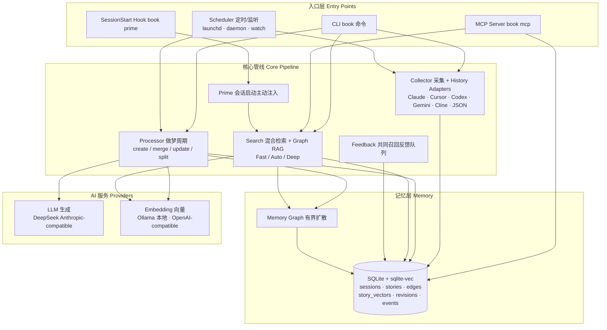
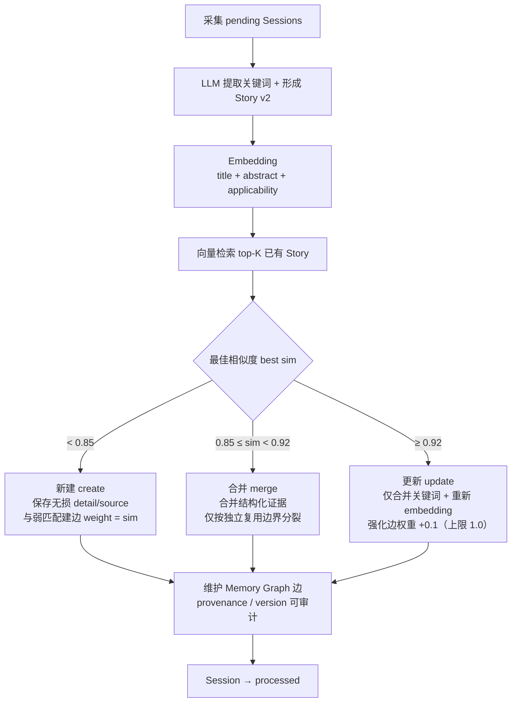
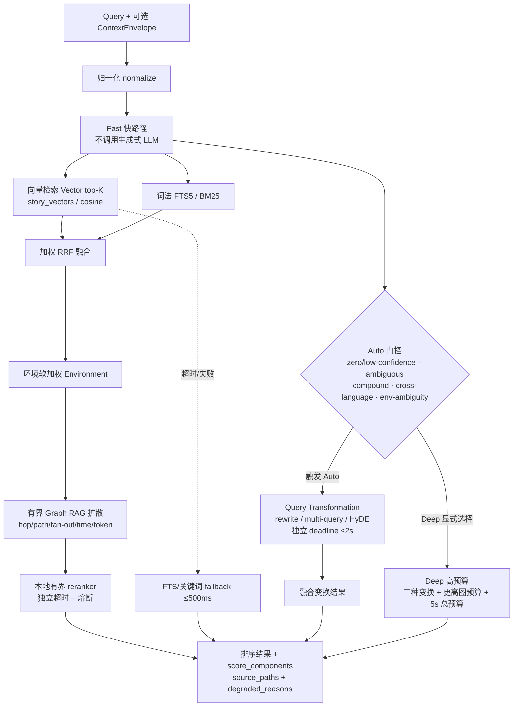
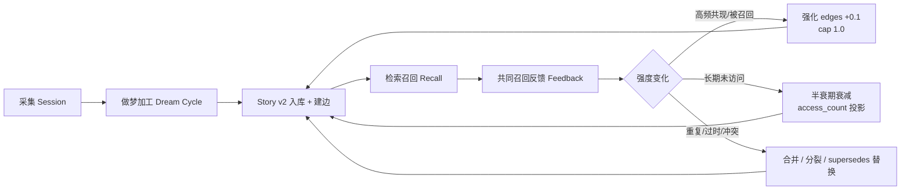

# 📖 Storybook

> **Local-first Agentic Memory Graph RAG** —— 把 Agent 的每一次会话整理成可复用的 Story，连成一张可被联想唤醒的记忆网。
>
> Turn your AI coding agent's scattered session history into an evolvable, queryable, personal memory graph — a "dream" that keeps what you learned across tools, projects, and devices.

---

## English Introduction

### What it is

**Storybook** is a **local-first, agentic memory-graph RAG system** for AI coding agents. It is *not* another knowledge-base Q&A tool. Instead of answering "what do you know?", it answers "what have you **done** — and what should you remember next time?".

Storybook ingests the raw session history your coding agents produce — **Claude Code, Cursor, Codex CLI, Gemini CLI, Cline, JSON files, or a built-in simulator** — and runs each episode through a **dream cycle**: it denoises the transcript and consolidates it into one or more self-contained, independently reusable memory units called **Stories**. A Story keeps the *problem, actions, outcome, applicable environment, and source evidence* together, never truncated by a fixed character budget. Stories are then linked into a weighted, typed **Memory Graph** with `semantic`, `temporal`, `causal`, `same_environment`, `parent_child`, `co_recall`, and `supersedes` edges — each edge carrying provenance, version, and reinforcement history.

At recall time, Storybook runs a **hybrid, Graph-RAG retrieval pipeline**:

1. **Fast path** — vector search + FTS/BM25 lexical ranking fused with weighted RRF, environment-aware soft weighting, bounded graph diffusion, and an optional local bounded reranker. **The fast path never blocks on a generative LLM.**
2. **Auto path** — only under explainable gates (zero/low confidence, ambiguity, compound, cross-language, or environment-ambiguous queries) does it spend a separate, bounded budget on **Query Transformation**: rewrite, multi-query, or HyDE.
3. **Deep path** — explicitly opt-in, high-budget recall with all transformations and higher graph budgets.

Every result returns its source paths and score components; co-recall feedback continuously reinforces (and half-life decays) the graph edges. All storage, profiles, and raw evidence stay on your machine by default: embeddings default to **local Ollama**, and remote embedding/generation APIs are only used when you choose them, with clear disclosure that text leaves your machine.

### The problem it solves

AI agents forget between sessions. Every new session restarts with no memory of the environment quirks, debugging paths, design decisions, and hard-won lessons from previous work. Storybook gives agents **cross-session experience reuse**: through the **MCP server** (`recall` / `get_story` / `stats` / `prime_context`) and a **`SessionStart` hook** (`book prime`), relevant past experience is proactively recalled at the right moment — and stays silent when it is not relevant, so it never pollutes the agent's context window.

### Core concepts

| Concept | Description |
|---------|-------------|
| **Session / Episode** | One working episode of an agent plus its raw evidence (source session log). |
| **Story (Memory Chunk)** | A single, independently reusable memory unit split from an episode: problem, actions, outcome, environment, applicability, and source evidence. Length is set by information completeness, never a hard character truncation. |
| **Memory Graph** | Typed, weighted relationships between Stories — semantic, temporal, causal, parent-child, same-environment, co-recall, alternative/evolution — with explainable edge weights and versions. |
| **User Profile** | Memory belongs to the *user*, not the project. Project / agent / device / runtime are retrieval context and applicability signals. Local by default; optional cross-device sync in the future. |

### Memory pipeline

1. **Memory Formation** — collect agent sessions, denoise, split into independently reusable Stories; keep environment + provenance; support merge / split / evolution.
2. **Embedding & Indexing** — embed Story `title + abstract + applicability`; maintain lexical, metadata, and graph indexes alongside; raw evidence expands on demand.
3. **Graph RAG** — seed from direct semantic hits, diffuse along constrained multi-type memory edges with path / weight / time / environment / feedback signals.
4. **Query Understanding** — low-latency direct query by default; only complex / ambiguous / low-confidence queries enter a separate budget for Query Transformation, multi-query, or HyDE — and only after ablation evidence proves the benefit.
5. **Hybrid Search & Rerank** — fuse vector, FTS/BM25, graph diffusion, environment / time / feedback signals via RRF / weighted fusion and an optional local reranker; return sources, applicability, environment differences, and degradation status.
6. **Agentic Recall** — proactive recall through MCP, hooks, and priming before or during agent execution; silent when irrelevant, fast degradation on failure.
7. **Memory Lifecycle** — reinforcement, decay, merge, split, supersede, and audit for duplicated, stale, conflicting, and frequently co-recalled memories; every change is traceable.

### Design principles

- **Memory is not an ordinary knowledge document** — episodes, environment, actions, and results are preserved.
- **Mature RAG techniques are introduced per-problem, not buzzword-stacked** — every strategy needs ablation evidence for quality, latency, and cost.
- **Query experience first** — the fast path is never blocked by a generative LLM; deep recall uses a separate mode and budget.
- **Local-first, private by default, sync optional** — absolute paths, hostnames, and raw external session IDs are never cross-device primary keys.
- **Quality and experience are measured together** — recall@k, MRR, environment fit, false-empty, p50/p95, time-to-first-value, and injected noise.

### Quick start

```bash
# 1. Download and review the installer (macOS / Linux, Python 3.11+, no sudo)
curl -fsSLO https://raw.githubusercontent.com/OrcaxNet/storybook/main/install.sh
less install.sh
sh install.sh

# 2. Pick Profile / model provider / agent adapter
book init

# 3. Run the dream cycle, then search your memory
book run --once
book search "what should I remember about this task?"
book status
```

> The detailed documentation below is primarily in Chinese; headings are bilingual (`中文 / English`), and every diagram is annotated bilingually so English readers can follow the architecture and flows.

---

## 目录 / Table of Contents

- [English Introduction](#english-introduction)
- [这是什么 / What it is](#这是什么--what-it-is)
- [特性 / Features](#特性--features)
- [整体架构设计 / Architecture](#整体架构设计--architecture)
- [核心流程图 / Core Flows](#核心流程图--core-flows)
- [环境要求 / Requirements](#环境要求--requirements)
- [安装 / Installation](#安装--installation)
- [用户级 Profile 与共享存储 / Profiles](#用户级-profile-与共享存储--profiles)
- [测试 / Tests](#测试--tests)
- [检索质量评测 / Evaluation](#检索质量评测--evaluation)
- [查询性能基线与本地诊断 / Performance](#查询性能基线与本地诊断--performance)
- [CLI 命令总览 / CLI Reference](#cli-命令总览--cli-reference)
- [使用 / Usage](#使用--usage)
- [做梦周期自动化 / Automation](#做梦周期自动化--automation)
- [MCP 接入 / MCP](#mcp-接入--mcp)
- [会话启动注入 / Session-start Injection](#会话启动注入--session-start-injection)
- [配置 / Configuration](#配置--configuration)
- [项目结构 / Project Structure](#项目结构--project-structure)
- [说明 / Notes](#说明--notes)
- [License](#license)
---

## 这是什么 / What it is

Storybook 采集 AI 编程会话日志（Claude Code 会话、Cursor 日志、Codex CLI、Gemini CLI、Cline、JSON 文件或内置模拟器），对每条会话跑一遍 **做梦周期（dream cycle）**：按“独立可复用结论 + 环境适用性”形成一个或多个 Story v2。每条 Story 保存 `title + abstract + structured detail + sources`；detail 与证据不硬截断，只有用于检索/展示的 abstract 有预算，并与已有记忆按相似度**合并 / 更新 / 新建**。

检索时，Fast 常态并行使用向量与 FTS/关键词排名，经加权 RRF、环境软信号和本地有界 reranker 融合，再以直接命中为 seed 在 hop、path、fan-out、墙钟时间和 token 预算内扩散 Memory Graph。Auto 仅在 zero/low-confidence、复合、跨语言或强环境歧义时进入独立预算的 Query Transformation/HyDE 第二阶段；Deep 必须由调用方显式选择。每条结果返回来源路径与分数组成；共同召回反馈会强化并衰减独立 `co_recall` 边。

系统采用**混合 provider**：生成式 LLM 通过 DeepSeek Anthropic-compatible Messages API；embedding 顶层统一为 `type=api`，默认使用本地 Ollama 推荐 preset，也可改用 OpenAI-compatible API。Fast 查询不调用生成式 LLM。选择远程 embedding API 时，待向量化的 Story/query 文本会离开本机。

## 特性 / Features

- 🧠 **语义边界记忆整理**：长而不可拆的经历保持完整；短会话中的多个独立结论拆成多条 Story，并共享来源 Session
- 🔗 **可解释 Memory Graph**：`semantic` / `temporal` / `causal` / `same_environment` / `parent_child` / `co_recall` / `supersedes` 多类型边，有明确方向、provenance、版本与软删除规则
- 📐 **可演进双索引**：当前 `story_vectors` 持续服务，模型/版本切换先增量写 shadow，完整后原子切换；失败可续跑
- 🔍 **自适应 Hybrid Search**：Fast 无生成式调用，融合 vector + FTS/关键词 + environment + Graph；Auto 按可解释门控启用 rewrite/multi-query/HyDE；Deep 使用显式高预算；任一组件失败均保留可用 fallback
- 🧵 **读写解耦**：向量召回与关联读取完成后立即返回，`access_count`/共同召回边权反馈由有界后台队列单事务写入
- 📈 **性能可观察**：每次查询分段记录 cache/embed/vector/lexical/fusion/transform/fallback/graph/rerank/serialize/total，`status --performance` 汇总最近 100 次 p50/p95；固定 10k Story benchmark 与离线策略消融同时守护质量/时延
- 🔌 **多数据源**：Claude Code 会话（主）、Cursor、Codex、Gemini CLI、Cline、JSON 文件/目录、内置模拟器
- 🏠 **本地优先**：Profile、原始证据与数据库留在本机；embedding 默认走本地 Ollama，选择远程 API 时会明确披露文本离机；云端调用均可快速降级
- 🤖 **MCP 召回**：通过 MCP server 把记忆检索暴露给 Claude Code 等 agent，新任务可主动 recall 过往经历，实现跨 session 经验复用
- 🌅 **晨间简报**：会话启动时基于 cwd / 首条提问**主动召回**相关记忆并注入上下文（`SessionStart` hook 或 `prime_context` MCP 工具），实现"下意识回忆"——更贴近初衷；token 预算内、相关度不足时**静默不注入**

## 整体架构设计 / Architecture

### 系统架构图 / System architecture



### 组件说明 / Components

| 组件 | 模块 | 职责 |
|------|------|------|
| **CLI** | `cli.py` | `book` canonical 命令入口，串起 init / run / search / status / mcp / admin |
| **采集** | `collector.py` + `history_adapters/` | 从 Claude Code / Cursor / Codex / Gemini / Cline / JSON / 模拟器采集会话；增量 checkpoint、损坏隔离 |
| **做梦加工** | `processor.py` | dream cycle：LLM 形成 Story v2 → embedding → 检索比对 → create / merge / update / split |
| **存储** | `store.py` | SQLite + sqlite-vec：sessions / stories / edges / story_vectors / revisions / events / tombstones |
| **记忆图** | `graph.py` | 多类型边、有界扩散、环/hub/重复抑制、supersedes 替换 |
| **检索** | `search.py` | Fast（vector + lexical + graph + rerank）/ Auto（门控变换）/ Deep（显式高预算），降级与诊断 |
| **自适应** | `adaptive.py` | 模式解析、查询规划、门控、变换融合、本地 reranker 与熔断 |
| **生成 LLM** | `llm.py` | DeepSeek Anthropic-compatible Messages API，强制命名 tool call + 本地类型校验 |
| **向量** | `embeddings.py` | 统一 embedding API（Ollama / OpenAI-compatible），维度校验与模型状态 |
| **反馈** | `feedback.py` | `access_count` / `co_recall` 边权异步队列，单事务写回 |
| **启动注入** | `prime.py` | 会话启动主动召回并生成 ≤2k token 简报，静默降级 |
| **MCP** | `mcp_server.py` | `recall` / `get_story` / `stats` / `prime_context` 四个工具，复用 `search` / `store` |
| **Profile** | `profiles.py` | 用户级 registry、平台目录、local/isolated Profile、数据库世代指针 |
| **上下文** | `context.py` | ContextEnvelope 采集、隐私归一、环境适配评分、项目身份解析 |
| **自动化** | `dreamd.py` | 文件锁互斥、反应式监听、定时守护、`dream.log` 幂等日志 |
| **健康检查** | `health.py` | `book doctor`：Ollama / 模型 / 维度 / sqlite-vec / 向量双写一致性 |
| **安装/卸载** | `setup_manager.py` + `setup_adapters/` | 一键 setup / 安全卸载，受管节点与回滚 |
| **迁移** | `migration.py` | v1 → v2 安全迁移与回滚，registry CAS 原子切换 |
| **评测/基准** | `eval/`、`perf_benchmark.py`、`graph_eval.py` | 检索质量评测、固定 10k Story 性能基准、图评测 |

### 模块数据流 / Module data flow

```
collector → store → processor (用 llm + embeddings) → search
                    ↑
                  cli.py 串起命令；config.py 集中所有路径/模型/阈值
```

---

## 核心流程图 / Core Flows

### 记忆形成：做梦周期 / Memory formation: the dream cycle

对每条 pending 会话：LLM 提取关键词并形成 Story v2 → 对 `title + abstract + applicability` 做 embedding → 向量检索 top-K 已有 Story → 按最佳相似度分支：



| 分支 | 触发条件 | 动作 |
|------|----------|------|
| **create** | best sim < 0.85 | 完整保存 structured detail/source；与 0.75–0.85 的弱匹配 Story 建边，`weight = sim` |
| **merge** | 0.85 ≤ sim < 0.92 | 合并新旧结构化证据；只有存在多个独立结论/适用条件才分裂，不以字符数触发。父行和 revision 链保留用于溯源 |
| **update** | sim ≥ 0.92 | 仅合并关键词、重新 embedding、强化已有边权重（+0.1，上限 1.0） |

### 检索：Fast / Auto / Deep



Fast 常态并行使用向量与 FTS/关键词排名，经加权 RRF、环境软信号和本地有界 reranker 融合，再以直接命中为 seed 在 hop、path、fan-out、墙钟时间和 token 预算内扩散 Memory Graph。**Fast 不调用生成式 LLM**；`graph_enabled=false` 可关闭图扩散。`--scope project` 使用 ContextEnvelope 中隐私安全的 repo/workspace 身份做硬过滤，只返回当前项目来源记忆；`profile` 保持用户级全库召回。

Auto 先完整执行 Fast，再依据 `zero_results`、`low_confidence`、`ambiguous_ranking`、`long_compound_query`、`cross_language`、`environment_ambiguity` 等稳定原因决定是否调用一次 DeepSeek LLM，生成 rewrite、multi-query 或 HyDE 辅助表示。第二阶段有独立 deadline，超时后原 Fast 结果立即作为 fallback 返回。Deep 显式启用三种 transformation、更高 Graph 预算及 5s 总预算。

本地 reranker 只处理有界 top-N，具有独立超时、连续失败熔断与冷却恢复；故障时返回 fusion/graph 排名并标明 `reranker_timeout` / `reranker_unavailable` / `reranker_circuit_open`，不会伪装成"无记忆"。

查询响应保留兼容字段 `mode=cache|vector|lexical_fallback`，并新增 `retrieval_mode=fast|auto|deep`、`transform_used`、`query_plan`、`transform_trace`、`rerank_trace`、`degraded_reasons`。每条 match 返回 `source_paths` 与 `score_components`（vector/lexical/RRF/graph/environment/rerank）。同一份阶段数据会写入本地 `logs/query_performance.jsonl`，但落盘接口只接受固定白名单字段：不保存原始 query、Story 内容、绝对路径、hostname 或仓库 URL。文件权限为 `0600`，超过大小上限后只保留最近记录。

### 记忆生命周期 / Memory lifecycle



删除 Story 时不物理删行：同一事务清除 serving 向量、追加 delete event 并写入不可变 `memory_tombstones`。查询默认排除 tombstone；本地事件重放采用 delete-wins，即使旧 create/update 事件晚到也不会复活对象。

---

## 环境要求 / Requirements

- **Python 3.11+**（推荐用 [uv](https://github.com/astral-sh/uv) 建 venv）
- **DeepSeek API 凭据**：优先 `ANTHROPIC_AUTH_TOKEN`，兼容 `DEEPSEEK_KEY`；默认读取 `~/.chrc/dpsk.sh`
- **Ollama（推荐）**：本地 preset 默认为 `http://localhost:11434` + `qwen3-embedding:0.6b` + 1024 维。旧 `OLLAMA_HOST` / `STORYBOOK_EMBED_MODEL` 会自动映射，无需重建现有索引
- **自定义 API（可选）**：设置 `STORYBOOK_EMBED_ADAPTER=openai_compatible`、base URL、model、dimension；凭据只通过 `STORYBOOK_EMBED_API_KEY_ENV` 引用环境变量

### 模型 Provider onboarding

`book` 是 canonical 命令，`storybook` 在兼容期保留旧入口。新安装会在 active Profile 内写入版本化的
`model-config.json`。**generation（LLM）与 embedding 是两个独立端点**，各自具备
协议 `ollama | openai | anthropic`、base URL、model 与可选的 credential 环境变量名；
文件只保存 credential 环境变量名，绝不保存密钥。base URL 提示会标注协议类型与 `/v1`
说明（openai 兼容需含 `/v1`、anthropic 走 `/v1/messages`、ollama 原生无需 `/v1`），
且不强制“全局 provider 单选”。本地/Ollama 端点的 secret 可留空，视为无凭据。

```bash
# 本地 Ollama（双端点均 Ollama）：探测服务，按需拉取 generation/embedding 模型
book init --llm-protocol ollama --llm-base-url http://localhost:11434 \
  --llm-model qwen3:8b \
  --embedding-protocol ollama --embedding-base-url http://localhost:11434 \
  --embedding-model qwen3-embedding:0.6b

# 混合场景：LLM=OpenAI-compatible（如 DeepSeek，/v1/chat/completions）+
#            Embedding=本地 Ollama（/api/embeddings），端点完全独立
export STORYBOOK_API_KEY='...'
book init --llm-protocol openai --llm-base-url https://api.deepseek.com \
  --llm-model deepseek-v4-flash --llm-api-key-env STORYBOOK_API_KEY \
  --embedding-protocol ollama --embedding-base-url http://localhost:11434 \
  --embedding-model bge-m3

# Anthropic-compatible LLM（/v1/messages）
export ANTHROPIC_AUTH_TOKEN='...'
book init --llm-protocol anthropic --llm-base-url https://api.deepseek.com/anthropic \
  --llm-model deepseek-v4-flash --llm-api-key-env ANTHROPIC_AUTH_TOKEN \
  --embedding-protocol ollama --embedding-model qwen3-embedding:0.6b
```

交互式 `book init` 按「LLM baseUrl → model → secret」→「Embedding baseUrl（默认=LLM）→
model → secret（默认=LLM）」顺序提示；embedding 取值可覆盖。非交互 flags 中，
`--provider / --base-url / --api-key-env` 是“同时作用于两个端点”的旧 shorthand，
`--llm-* / --embedding-*` 按端点独立覆盖。

外部 embedding 必须返回当前 Profile 配置的 `STORYBOOK_EMBED_DIM` 维度，否则
setup/doctor 会报告 dimension mismatch。base URL 中的 userinfo、query 和 fragment
会被拒绝，doctor/status/JSON 输出不会包含 credential 值或 Authorization header。
未生成 Profile 配置的旧安装继续按“Profile 配置 > 旧环境变量 > 默认值”的优先级
只读解析 `ANTHROPIC_*`、`DEEPSEEK_KEY`、`OLLAMA_HOST` 与
`STORYBOOK_EMBED_MODEL`，无需迁移现有数据。

已有 Profile 的 active 向量索引会持久化 provider、base URL、model 与 version
身份。setup 若检测到目标 embedding space 不兼容，会在任何写入和网络探测前以
`SB_MODEL_INDEX_INCOMPATIBLE` 失败；可保持原配置，或先运行
`book profile create provider-migration --switch` 创建隔离 Profile 后重新
setup。不同 provider/base URL 即使模型同名，也不会共享 inference/query cache。
- 依赖：`click`、`requests`、`numpy`、`sqlite-vec`、`mcp`（Agent 接入所需）

```bash
# 拉模型
ollama pull qwen3-embedding:0.6b
```

## 安装 / Installation

> 从下载到首次 recall 的完整路径。

```bash
# 1. 下载并审阅安装器（macOS/Linux、Python 3.11+，不使用 sudo）
curl -fsSLO https://raw.githubusercontent.com/OrcaxNet/storybook/main/install.sh
less install.sh
sh install.sh

# 2. 选择 Profile、Provider/model、Agent adapter 与可选 watch schedule
book init

# 3. 查看状态并完成首次有效 recall
book status
book search "what should I remember about this task?"
```

非交互环境可使用 `book init --agent codex --yes --json` 配合双端点模型 flags
（`--llm-protocol/--llm-base-url/--llm-api-key-env` 与
`--embedding-protocol/--embedding-base-url/--embedding-api-key-env`，旧
`--provider/--base-url/--api-key-env` 仍可同时作用于两个端点）；API 密钥只从
指定的凭据环境变量读取，Profile 只保存变量名。
`book setup` 是一个 minor release 内的隐藏兼容 alias。旧 `storybook init` 继续只做
数据库初始化，低层 canonical 入口为 `book admin init-db`。

`curl ... | sh` 会把远端当前内容直接交给 shell，无法先审阅，且信任 HTTPS、GitHub
账号与发布流程；安全要求较高时使用上面的“下载 → 审阅 → 执行”路径。安装器默认写入
`~/.local`，不会修改 shell rc；PATH 缺失时只打印可复制的修复命令。指定版本升级会下载
官方 release checksum，先在临时 venv 验证并安装，最后原子切换；失败时旧版本仍可运行：

Storybook 的 sqlite-vec 索引要求 Python SQLite 支持 loadable extensions；安装器会在任何
写入前检查该能力。macOS arm64 若使用了不具备该能力的 Python，可执行
`brew install python@3.11`，再以
`STORYBOOK_INSTALL_PYTHON=/opt/homebrew/opt/python@3.11/bin/python3.11 sh install.sh`
重试。

若安装器在创建隔离环境时报 `SB_INSTALL_VENV_FAILED`（venv 内部的 `ensurepip` 引导
pip 失败，无法创建隔离环境），说明当前 Python 的 venv/ensurepip 受损。已知的常见触发
场景：

- **符号链接调用 uv 托管的 Python**：通过 `~/.local/bin/python3` 这类符号链接执行
  uv 托管的 Python 时，venv 会把 `pyvenv.cfg` 的 `home` 指向符号链接所在目录（该
  目录没有标准库），导致 ensurepip 引导失败（见 astral-sh/uv#16411）。安装器会在
  创建 venv 前把 `$PYTHON` 解析为真实路径再执行，已覆盖该场景；
- **alpha/beta/rc 预发布版本**：预发布 Python 的 venv/ensurepip 可能损坏，且
  sqlite-vec/numpy 等依赖不保证提供 wheel；安装器会在检测到预发布版本时输出警告。

修复方式是改用稳定版 Python 后重试：

- uv 托管：`uv python install 3.12`，再以
  `STORYBOOK_INSTALL_PYTHON="$(uv python find 3.12 --resolve-links)" sh install.sh`
  重试；
- macOS Homebrew：`brew install python@3.12`，再以
  `STORYBOOK_INSTALL_PYTHON=/opt/homebrew/opt/python@3.12/bin/python3.12 sh install.sh`
  重试；
- Debian/Ubuntu：`sudo apt install python3-venv` 后重试。

安装器在失败时会原样输出 venv 的真实错误，并给出上述针对性修复指引；失败不会影响
既有版本，也不会在 prefix 下留下残留 target。

```bash
sh install.sh --version 0.2.0
sh install.sh --prefix "$HOME/tools/storybook" --no-init
sh install.sh --dry-run                       # 严格零写入
```

维护者发布版本时推送 `v*` tag；release workflow 会先运行完整测试，再执行
`scripts/build_release_assets.sh` 构建并验证固定文件名的 `storybook.tar.gz` 与
`storybook.tar.gz.sha256`，随后发布到 GitHub Release。也可在本地安装 `build` 后执行
`./scripts/build_release_assets.sh ./release-assets` 复现同一发布门禁。

卸载程序文件时，删除安装 prefix 下的 `bin/book`、`bin/storybook` 和
`lib/storybook` 即可。用户 Profile/记忆位于平台数据目录，不随程序升级或上述删除而
清除；如确实要删除数据，使用 `book uninstall --purge-data` 的显式双重确认流程。

开发者不想安装 release 也可直接跑模块：

```bash
uv venv .venv
VIRTUAL_ENV=$(pwd)/.venv uv pip install -e .
PYTHONPATH=src .venv/bin/python -m storybook.cli <command>
```

### 一键 setup 与安全卸载

`book init` 会先展示完整改动计划，再创建用户级 Profile/schema、检测并接入
Claude Code、Cursor、Codex。Ollama 推荐 preset 会检查/下载本地 embedding 模型；自定义 API 不会调用 Ollama 的 tags/pull 接口。最后执行 schema、embedding、
adapter、recall smoke test。三类 Agent 都复用同一个 `book mcp` stdio server；Claude
Code 还会安装幂等的 `SessionStart` recall hook。无需手工编辑 JSON/TOML。

```bash
book init                               # 交互确认
book init --yes                         # 非交互安装
book init --dry-run                     # 严格零写入（不建目录/DB、不下载模型）
book init --json                        # 结构化结果，便于自动化
book init --agent codex --yes           # 可重复 --agent，覆盖自动检测
book init --enable-schedule --yes       # 生成用户级 watch service（无需 sudo）
book init --skip-models --yes           # 离线跳过缺失模型，状态为 degraded
book init --yes --embedding-preset ollama
book init --yes --embedding-preset custom \
  --embedding-base-url https://embedding.example/v1 \
  --embedding-model your-model --embedding-dimension 1024 \
  --embedding-version your-model-v1 \
  --embedding-api-key-env PRIVATE_EMBED_API_KEY

book admin uninstall                    # 恢复 setup 写入的节点，默认保留全部记忆
book admin uninstall --dry-run
book admin uninstall --purge-data       # 交互式二次确认后永久删除数据
book admin uninstall --yes --purge-data --confirm-purge  # 非交互双重显式确认
```

配置更新使用同目录原子替换，并在用户 state 目录保存原文件备份与 hash；重复执行不会
重复 MCP 节点或 hook。卸载只恢复名为 `storybook` 的受管节点，保留其他 server、hook
和设置；若节点在安装后被人工修改，会报告 drift 并保留恢复状态，避免覆盖用户改动。
旧项目级 `data/memory.db` 只会在计划/结果中提示，不会由 setup 擅自迁移或删除。

`--embedding-preset ollama` 自动填入本地地址、推荐模型、1024 维和 Ollama adapter。`custom` 需显式提供 base URL、model 和 dimension；只持久符合 `[A-Za-z_][A-Za-z0-9_]*` 的凭据环境变量名，疑似明文凭据会在任何写入前被拒绝。选择会保存在用户级 setup state，之后的 CLI/MCP 进程自动复用，而显式环境变量仍优先。非 loopback endpoint 始终显示“文本将离开本机”警告。

Serving index 的身份包含 endpoint、adapter、model、version、dimension 和非敏感的 credential-env 引用。修改任一项会进入 `serving_index_mismatch`；默认查询继续使用旧 index 对应的 API 与凭据引用，直到 `embedding-backfill` 完成 shadow generation 并原子切换，避免将不同向量空间混入同一索引。旧版 schema 只支持 Ollama，因此升级时会按既有 `OLLAMA_HOST`/默认地址映射 active identity，不改写 Story 或向量索引；custom API identity 不会被猜测。

## 用户级 Profile 与共享存储 / Profiles

首次运行会创建随机 UUID 的 `local` Profile。Claude Code 采集、Cursor 采集、CLI、hook 与 MCP（包括 Codex 等 MCP-aware agent）都经同一份 registry 解析当前数据库，因此切换项目 cwd、移动或重命名 Storybook 仓库不会改变记忆归属。

| 平台 | Profile 数据根 |
|------|----------------|
| macOS | `~/Library/Application Support/Storybook/profiles/{profile_id}/` |
| Linux | `${XDG_DATA_HOME:-~/.local/share}/storybook/profiles/{profile_id}/` |
| Windows | `%LOCALAPPDATA%\Storybook\profiles\{profile_id}\` |

数据库/索引位于 Profile 数据根，缓存与日志走各平台的 cache/state 目录；目录权限在 POSIX 上为 `0700`，registry 与数据库为 `0600`。registry 只持久化随机 UUID、显示名、模式、同步状态和 Profile 内的相对数据库世代指针，不把用户名、hostname 或绝对路径当作主键。

```bash
book profile show                         # 当前 Profile、数据目录与 local-only 状态
book profile list                         # 列出所有 Profile
book profile create client-a              # 默认创建 isolated Profile
book profile switch client-a              # UUID 或显示名均可
book status                               # 运行状态（含 sync local_only、跨设备同步未启用）
```

可用 `STORYBOOK_PROFILE=<UUID|NAME>` 为单个进程选择 Profile 而不修改 registry；`STORYBOOK_HOME=/private/path` 可显式收拢/隔离 registry、数据库、缓存和日志。旧仓库 `data/memory.db` 不会被删除或覆盖；安全迁移由独立的 migration 流程负责。

### v1 → v2 安全迁移与回滚

迁移的发现、dry-run、备份与转换阶段始终只读打开旧项目库，先做一致性备份，再在隔离
的数据库世代内转换和校验。
Session、Story、edge 及关系必须逐项等量；已有 embedding 会进入 sqlite-vec serving
索引并执行真实查询 smoke test。v1 `content` 原样保存在 `legacy_raw`，Story v2 detail/source
同步生成，`abstract_status=pending` 留给后续异步补全。所有检查通过后，才以一次原子
registry CAS 切换 `database_ref`。切换前会在 SQLite 单写者边界内再次核对源库逻辑
hash；backup 后的提交会使迁移明确失败，活动写事务也会阻止切换。对于可写的待退役
世代，同一事务会预置持久拒写触发器；所有退役 fence 与目标 unfence 先持久化，最后才
执行 registry CAS，因此指针落盘后不再有可失败的 SQLite commit。任一 prepare commit
失败或结果不确定时，会在旧指针仍有效时补偿恢复切换前状态。这些旧连接会收到
`SB_MIGRATION_GENERATION_FENCED`，不能在成功切换后向旧世代落入独有数据。只读源库
使用稳定读事务做同一 CAS。rollback 对活动 v2 使用相同协议，副本另存基线 hash；若
回滚后产生新写入，重复迁移会拒绝复用陈旧 v2 世代。因此失败不会改变旧库权威，也不会
静默覆盖回滚后的权威数据。

```bash
book admin migration discover --json
book admin migration run ./data/memory.db --dry-run --json  # 严格零写入
book admin migration run ./data/memory.db --json            # 备份、转换、校验、切换
book admin migration status --json
book admin migration rollback <migration_id> --json         # 原子切回独立 v1 副本
book admin migration delete-backup <migration_id> --yes      # 用户显式永久删除
```

`migration_id` 由目标 Profile 与源库逻辑 SHA-256 确定；重复运行同一源库直接复用已验证
世代，不插入重复对象。当前 Profile 已有 Session/Story/edge 时迁移会拒绝覆盖，应先创建
一个新的空 Profile。原始记忆行不会删除或覆盖；成功切换只在可写旧库中增加世代拒写
触发器，失败切换会回滚该 DDL。受管 v1 只读备份至少保留 30 天，且不会自动提前删除。

---

## 测试 / Tests

测试套件覆盖 `store` / `processor` / `search` 三个核心模块的关键路径与边界，
**完全不依赖真实 DeepSeek/Ollama**——所有 LLM / embedding 调用均被 mock 桩替换，本地一键可重复运行。

```bash
# 1. 安装测试依赖（与运行时依赖一并）
VIRTUAL_ENV=$(pwd)/.venv uv pip install -e ".[test]"

# 2. 一键运行全部测试
.venv/bin/pytest

# 带覆盖率报告（聚焦 store/processor/search）
.venv/bin/pytest --cov=storybook --cov-report=term-missing
```

测试不启动 Ollama、不访问 DeepSeek：HTTP 与 embedding 均使用 mock。
用例要点：

- **store**：Session/Story CRUD、`_edge_pair` 无向边归一、`search_by_vector` 的 `1 - dist²/2`
  相似度换算（与 numpy 暴力余弦交叉验证）、双写一致性（`add_story`/`update_story` 后
  `stories.embedding` 与 `story_vectors` 同步；分裂后父 story 向量从索引移除），以及旧 schema
  对 `global_id` / `profile_id` / `sync_state` 的幂等补齐。
- **profiles**：macOS/Linux/Windows 路径、XDG 覆盖、随机 UUID registry、local/isolated
  切换、跨 cwd 一致性、损坏 registry 拒绝覆盖和最小权限。
- **processor**：create / merge / update 三分支 + split 路径，mock `llm`/`embeddings` 返回固定值，
  验证分支选择与边建立（弱关联建边、共同召回提权、父子/兄弟边）。
- **Story v2**：千 token 原子 Story 无损保存、短会话双结论共享 Session、summary/detail 分层、revision 链，以及 embedding backfill 失败续跑与原子切换。
- **MemoryEvent**：UUIDv7 单调性、create/update/merge/split/delete 版本链、事件/tombstone 不可变、删除重放不复活、payload 隐私白名单，以及 `sync status` 零网络请求。
- **search/graph**：阈值过滤、关联激活、共同召回提权（每对每次仅 +0.1 一次）、单/多跳扩散、路径解释、环/hub/重复抑制、supersedes 替换和独立预算截断。
- **performance**：阶段时钟故障注入、最近窗口百分位、cache/fallback 比例、诊断隐私白名单，以及 warm/cold、并发 1/5 benchmark 编排（测试用小数据集与 mock embedding）。
- **prime**：query 构造（cwd / first_prompt）、主动注入门槛（高于检索）、token 预算裁剪、静默不注入（空库 / 低于门槛 / embedding 失败 / schema 缺失均不抛错）。
- **集成**：用 `generate_sample_sessions` 与 `test_logs/*.json` 跑通 collector → store → processor → search 全链路。
- **dreamd（做梦周期自动化）**：`fcntl.flock` 并发锁互斥与释放、`run_dream_cycle_once` 采集+加工/跳过/空、监听循环首帧追补与变化触发、定时守护、信号退出、`logs/dream.log` 幂等写入。全 mock，不依赖 Ollama。
- **MCP server**：`tests/test_mcp_server.py` 覆盖四个工具（`recall`/`get_story`/`stats`/`prime_context`）的核心逻辑与 FastMCP 装配/端到端调用。

## 检索质量评测 / Evaluation

PRD 要求「重复 bug 检索准确率≥70%」但原本无任何评测手段。`book admin eval` 建立可重复的检索质量基线，
作为调参与算法改进的度量依据。评测需要已配置的 embedding API 可用，并在隔离临时库中运行，不污染用户 Profile 数据库。仓库现有固定评测证据使用本地 Ollama `qwen3-embedding:0.6b`；不同 endpoint、adapter、模型、维度或版本的指标不可直接等同。

```bash
book admin eval all                            # 跑全部六轮评测（默认）
book admin eval retrieval                      # 仅检索评测
book admin eval exact-term                     # 精确代码 token：纯向量 vs Hybrid
book admin eval all --report data/eval_reports/baseline.json  # 落盘 JSON 报告，便于阈值调整前后对比
python scripts/eval.py retrieval                # 等价独立脚本（未做 editable 安装时用）
python scripts/generate_eval_transforms.py --variant ambiguous --timeout 30 \
  --output data/eval_reports/query-only-transforms.json
book admin eval strategy --transform-cache data/eval_reports/query-only-transforms.json
```

六轮评测：

1. **retrieval** — 用 `data/retrieval_benchmark.json`（24 topic × 3 查询变体 = 72 对，含精确术语 / 同义改写 / 跨语言 EN↔ZH + 负例），
   真实 embedding 索引人工标注 story 语料，度量 recall@1/3/5、precision@k、MRR、负例特异性，并判定是否达 recall@3≥70%。
   同时输出 `SIM_THRESHOLD_SEARCH` 阈值敏感性曲线。
2. **processing** — 真实 embedding + 确定性 LLM 桩（人工关键词/摘要），度量 merge/update 分支是否选对
   （duplicate 应并入、distinct 应新建），输出 `SIM_THRESHOLD_HIGH` 阈值敏感性曲线。隔离度量 0.85/0.92 阈值，排除 LLM 关键词质量波动。
3. **split** — 真实 embedding + 确定性 LLM 桩，度量分裂路径结构正确性（父向量移除、父子边 1.0、子向量入索引、子 story 可检索）。
4. **ablation** — 比较 legacy、默认 `title+abstract+applicability`、全文单向量、title/abstract/applicability 分字段多向量；按 exact/synonym/cross-tool/cross-language 报告 recall@3/MRR 与索引/查询时延。
5. **strategy** — 比较 direct-vector、hybrid、+graph、raw-query `+reranker` 控制组、+rewrite、+HyDE、+reranker；按 exact/synonym/cross-language/cross-tool/ambiguous 报告 recall@3/MRR/p95。Transformation provider 只能收到原始 query、策略名和 timeout，`topic_id` 只在排序完成后计分；预生成文件按 query SHA-256 索引并拒绝 `topic_id`/目标 Story 字段。报告分别标记 `live_generated`、`query_only_pre_generated`、`oracle_upper_bound`，oracle 永不参与默认选型，预生成质量证据也必须有独立在线时延证据。只有 hard-query 质量提升、overall 非劣、ground-truth 隔离和 fast/deep 在线时延门槛全部通过的策略才标记 `eligible_for_default=true`。
6. **exact-term** — 构造 compact semantic vector 相同、仅 detail/keywords 中精确错误码不同的隔离语料，直接对比 vector-only 与 FTS5/BM25 + vector RRF 的 recall@3，验证代码 token 不被语义向量吞没。

Story v2 固定报告（2026-08-02，`data/eval_reports/story-v2-ablation-2026-08-02.json`）：四种表示在 24 topic × 4 分组上 recall@3/MRR 均为 100%；默认表示相对 legacy 为 `0.00pp`，通过“下降不超过 2pp”门槛。默认单向量索引均值 84.4ms/story，明显低于全文 205.2ms 与多向量 223.7ms；多向量检索 p95 0.94ms，高于默认 0.34ms，因此选择默认表示。

Memory Graph 固定报告（2026-08-02，`data/eval_reports/memory-graph-2026-08-02.json`）覆盖七类边、单/多跳和负例：人工关联子集中 vector-only → Graph RAG 的 recall@5 为 `0% → 100%`，overall recall@3 为 `100% → 100%`；10k active Story、10,063 条边、200 次扩散的 `graph_ms p95=3.030ms`。可用以下命令复现（无需 Ollama）：

```bash
python -m storybook.graph_eval --stories 10000 --repeats 200 \
  --output data/eval_reports/memory-graph.json
```

自适应检索固定报告（2026-08-02，`data/eval_reports/adaptive-retrieval-2026-08-02.json`）使用 24 topic × 5 分组，并引用 query-only 生成物 `data/eval_reports/flo152-query-only-transforms-2026-08-02.json`。ambiguous 组模拟“只记得 outcome/指标、不记得问题名与工具”的经历召回：direct-vector hard recall@3 为 `87.5%`、overall 为 `90%`；不使用任何 transformation 的 `hybrid_graph_reranker` hard/overall recall@3 为 `97.92%/98.33%`（hard `+10.42pp`），MRR `0.8875 → 0.9841`，p95 `99.7ms`，因此是唯一默认候选。reranker 只批量读取有界 top-N 的本地 detail 作为内部打分文本，响应前移除，不默认展开原始证据。24 条 ambiguous query 的 query-only 预生成 rewrite/HyDE 可把 hard/overall recall@3 提升到 `100%/100%`，但本机生成耗时约 10–20s，报告将 `online_latency_evidence=false`，所以这些策略即使离线检索 p95 ≤525ms 也不能默认启用。报告明确记录 artifact SHA、模型、prompt 版本、24 次 cache hit/96 次未触发、ground-truth generation fields 为空；oracle upper bound 未使用且始终无默认资格。

10k Story 固定性能报告为 `data/perf_reports/flo152-warm.json`：并发 1/5 的 cache lane p95 `3.323/4.197ms`，vector/hybrid lane p95 `123.418/480.637ms`，recall@3/MRR 均为 `100%/1.0`。`data/perf_reports/flo152-deep-smoke.json` 是 6 查询×1、并发 1 的 Deep smoke：总 p95 `4.547s`、recall@3 `100%`、degraded ratio `100%`、lexical fallback ratio `16.67%`；本机 9B LLM 在短生成 deadline 内会超时，并与 embedding 模型发生内存换入竞争，响应因此明确降级到 Fast/lexical 结果。该 smoke 证明总预算与 fallback，不把它冒充为生成式质量或成功时延证据；rewrite/HyDE 目前保留为 gated/显式能力，不能在这台机器上默认启用。

当前基线（2026-07-19，`data/eval_reports/baseline-2026-07-19.json`）：recall@3 = 100% ✅ 达标；
合并正确率 85.7%（`dup-docker-dns` sim 0.83 落在 0.85 阈值下方被误判为 create，阈值敏感性显示 0.82 可达 100%）；
分裂结构正确率 100%。`tests/test_eval.py` 用确定性 mock 覆盖评测逻辑本身，无需 Ollama。

## 查询性能基线与本地诊断 / Performance

日常查询会自动记录无内容诊断。查看最近 100 次查询：

```bash
book status --performance
book status --performance --json
```

`status --json` 同时返回当前 `profile`、混合 provider `model`、setup 管理的
`adapter`、`sync` 与计数字段。组件全部可用时 `status=ready`；Profile、模型或
已配置 adapter 不可用时返回 `status=ready_degraded`，并通过稳定的
`degraded_reasons`（例如 `llm_credentials_missing`、`endpoint_unreachable:embedding`、`authentication_failed:embedding`、`credentials_missing:embedding`、`model_unavailable:embedding`、`response_protocol_incompatible:embedding`、`dimension_mismatch:embedding`、
`adapter_unavailable:codex`）解释降级，不把可用的本地数据库误报为整体失败。
`doctor` / `status` 还会对比 API 实际维度与 active `story_vectors` 维度、model/version；切换未完成时返回 `serving_index_mismatch:embedding`，保留旧索引并要求先做 shadow backfill。Ollama payload 额外暴露 `model_state=warm|cold`。不同维度的 backfill 完整后，activation 在同一事务内重建 vec0 表并切换。

完整性能基准复用 `data/retrieval_benchmark.json` 的人工 ground truth，并在隔离临时库中构造固定 seed 的 10k Story 数据集。默认跑 50 条固定查询、每条重复 20 次、并发 1 和 5，报告机器/模型状态/规模/重复次数、所有阶段的 p50/p95/p99，以及按 exact/synonym/cross_lang 分组的 recall@1/3/5 和 MRR。基准不会污染用户数据库，也不会把原始 query、Story 内容、绝对路径或仓库 URL 写入报告。

仓库内已有固定评测证据使用 `type=api`、`adapter=ollama`、完整模型名 `qwen3-embedding:0.6b`、1024 维和 `story-v2-default-v1` 版本。新报告会同时记录 type/adapter/model/dimension/version；任一字段不同时，指标不应直接等同。

```bash
# warm：先预热模型，再跑 10k × 50 × 20 × concurrency(1,5)
book admin benchmark --model-state warm --report data/perf-warm.json

# cold：每个并发批次前用 Ollama keep_alive=0 卸载 embedding 模型
book admin benchmark --model-state cold --report data/perf-cold.json

# 快速 smoke（报告会如实记录非标准规模）
book admin benchmark --stories 100 --queries 6 --repeats 2 --concurrency 1
```

连续运行时应比较报告中的 machine、embedding model/dim、model_state、dataset seed/size、repeats 与 concurrency；这些字段不同足以解释大多数基线漂移。报告同时按 `cache` / `vector` / `lexical_fallback` lane 给出 p50/p95/p99，分别核验 cache hit ≤80ms、warm ≤1s、cold ≤5s。cold 场景每批先卸载模型并清空进程内缓存，避免把 cache hit 误算为冷启动。

查询快路径不调用生成式 LLM。MCP 启动时 best-effort 预热 embedding，后续每次请求用 `keep_alive` 续期；warm 2s、cold 5s 到达硬超时后立即尝试 FTS5 + 参数化关键词 fallback，fallback 自身最多 500ms。响应中的 `result_state` 明确区分：

- `results` / `no_match`：正常向量或缓存路径；`no_match` 才表示已完成正常检索但没有相关记忆。
- `degraded_results` / `degraded_empty` / `degraded_unavailable`：降级命中、降级空结果、降级自身不可用；这些状态不应被解释为已确认“没有相关记忆”。

## CLI 命令总览 / CLI Reference

`book` 是 canonical 入口（`storybook` 是同名兼容 alias，二者安装时都会生成）。
高频任务放在顶层，低频能力归入分组；主要任务不超过两层：

```text
高频顶层:
  book init                    初始化向导（Profile → 模型 → Agent → schedule → smoke）
  book doctor [--fix]          环境与健康自检
  book run [模式]              采集并形成记忆
  book search "<query>"        搜索记忆
  book status [--performance]  运行状态
  book mcp                     启动 MCP server（stdio）

分组:
  book memory list|show|forget            记忆管理
  book source list|enable|disable|reset   本机 Agent 历史来源
  book profile list|show|create|switch    用户级 Profile
  book admin init-db|migration|index|benchmark|eval|uninstall   低频维护
```

`book run` 四种模式（互斥，冲突组合 fail-fast）：

| 模式 | 行为 |
|------|------|
| `book run` / `book run --once` | 单次完整周期：采集启用来源 + 加工 pending 后退出（launchd/cron 入口） |
| `book run --watch [--source X] [--interval N]` | 反应式监听，有新会话自动采集 + 加工（长驻） |
| `book run --daemon [--interval N]` | 定时守护循环，每 N 秒一轮（默认 4 小时） |
| `book run --session ID` | 只加工指定 Session（单次） |

### 兼容 alias（一个 minor release 后移除）

`setup`、`process`、`dream`、`import-data`、`sources`、顶层 `list/show/forget/stats`
以及 `storybook` executable 保留为隐藏兼容 alias，调用与 canonical 相同的业务函数，
默认从 `--help` 隐藏。经 alias 调用时会向 **stderr** 打印移除提示，JSON / MCP
**stdout 保持协议纯净**。低频命令的旧顶层位置（`migration`/`uninstall`/`embedding-backfill`/
`benchmark`/`eval`）已迁至 `book admin ...`，不保留顶层 alias。

旧 `storybook init` 在兼容期只做数据库初始化（不进入交互向导），低层 canonical 入口为
`book admin init-db`。计划在下一个 minor release 移除上述全部兼容 alias。

---

## 使用 / Usage

```bash
book init                            # 初始化向导：Profile/模型/Agent/schedule/smoke（其它命令也会自动初始化）
book init --yes                      # 非交互安装
book admin init-db                   # 仅初始化数据库 schema + vec0 虚表（低层入口）
book admin uninstall [--purge-data]  # 恢复受管配置；默认保留记忆
book profile show|list               # 查看用户级 Profile 与数据目录
book profile create NAME             # 创建 isolated Profile（可加 --switch）
book profile switch ID_OR_NAME       # 切换当前 Profile
book status                          # 运行状态；--performance 输出最近 100 次查询 p50/p95
book memory list [--limit 20]        # 列出所有 Story
book memory show <story_id>          # 查看 Story 详情（含关联记忆与来源环境）
book memory forget [--min-age-days 90] [--apply]  # 衰减并预览/归档低价值记忆（默认仅预览）
book source list --json              # 检测本机来源及启用/版本/最近导入状态
book source disable codex            # 关闭某来源（enable 重新启用）
book source reset codex --yes        # 删除来源 checkpoint 后安全重扫
book search "<query>" [--top 3] [--scope profile|project|strict] [--mode fast|auto|deep] [--json]
book run [--session ID]              # 做梦周期：采集 + 加工全部（或指定一条 Session）
book run --watch [--source codex] [--interval N]  # 监听全部启用来源或指定单源
book run --once [--source codex]     # 单次多来源采集+加工；launchd/cron 入口
book run --daemon [--interval N]     # 定时守护进程（非 macOS 兜底，每 N 秒一轮，默认 4h）
book admin index --version <v> [--model <m>]  # 增量重建 embedding shadow 并原子切换
book admin benchmark --model-state warm|cold  # 隔离的 10k Story 性能+质量基准
book admin eval all                  # 检索/加工/分裂/消融评测（低频维护）
book admin migration discover|run|rollback|status|delete-backup  # v1 → v2 安全迁移
book mcp                             # 启动 MCP server（stdio，供 Claude Code 等 agent 运行时召回）
```

文本搜索会在主命中和“联想到的相关记忆”前展示真实 Story ID。可直接用该 ID 展开详情；脚本或 Agent 则可使用 `--json` 获取同一份检索结果（包括主命中与 related 的 `story_id`）：

```bash
book search "开发一个语音机器人" --top 1
# 主命中示例：📌 #42 未命名记忆
book memory show 42

book search "开发一个语音机器人" --top 1 --json
```

> 兼容 alias 期（一个 minor release 内）：`storybook process`、`storybook dream`、
> `storybook import-data`、`storybook sources ...`、顶层 `storybook list/show/forget/stats`
> 仍可用并调用相同业务函数，但默认从 help 隐藏，提示只写 stderr。
> `--source`、`--claude`、`--cursor`、`--codex`、`--sample` 与 `<path>` 互斥。

Agent history 为 local-first：单来源损坏会在 summary 标记 `degraded`，但不阻断其他来源。MCP 接入与 history ingestion 是两个独立状态。支持矩阵、schema/version 证据及隐私边界见 [Agent History Adapter compatibility](docs/AGENT_HISTORY_ADAPTERS.md)。

Codex JSONL 按 **append-only 增量源**处理：热路径只读取固定上限的文件身份/guard 证据和 checkpoint cursor 后新增的完整记录，复杂度为 `O(delta + C)`，不会为验证全部历史而每轮重读整个文件。文件被原子替换、inode/device 改变、尺寸缩短，或 guard 覆盖的边界发生变化时，会安全回退全量解析。对于同 inode 且继续增长、只改写 guard 未读取的历史中部字节，Storybook 不承诺自动发现；这不属于 supported 来源契约。

若上游工具或用户改写了既有历史，使用以下命令删除该来源的 checkpoint；下一轮 import/dream 会完整重建 checkpoint，其他来源不受影响：

```bash
book source reset codex --yes
book run --source codex --once
```

### ContextEnvelope 与环境感知召回

每条新 Session 都保存 `tool/device/session/workspace/runtime/captured_at/provenance`；每个未知叶子字段使用 `null`（`runtime.kind` 使用枚举 `unknown`）并标记 `provenance=unknown`。Claude/Cursor adapter 采集 `detected/reported/inferred/user_confirmed` 来源，原始外部 session ID 使用 Profile 本地 HMAC，绝对路径、hostname、remote host 与 repo URL 只保留哈希或短别名。

Story 合并多个 Session 时会保留全部来源环境，不由最后一次会话覆盖。历史导入和实时采集都会从 cwd 解析 Git 根目录与 origin：远端仓库哈希作为主身份，同时保留根目录的 Profile 本地 HMAC 作为兼容身份，因此旧版仅含路径指纹的 Story 仍可在 `scope=project` 下召回，且绝对路径不会落库。双方都有远端主身份时以远端为准，不允许相同本地路径覆盖 remote 冲突；仅有一侧缺少远端证据时才使用路径兼容身份。搜索的语义相似度始终是主信号：默认 `scope=profile` 仅以 workspace/tool/runtime/OS 等环境信号做有界软加权，冲突结果仍可召回并带 `warnings`；只有调用方显式指定 `scope=strict` 才过滤环境冲突。`book memory show` 展示来源环境以及 `applies_when` / `excludes_when`。

### 快速体验（无真实会话）

```bash
book run --once                         # 采集 + 加工一次
book search "如何调试数据库连接"          # 搜一下
book status                             # 看看沉淀了多少 Story / 状态
```

## 做梦周期自动化 / Automation

「做梦」无需手动触发。三种自动化入口（均复用同一把文件锁，互不重叠；运行日志落当前 Profile 日志目录的 `dream.log`）：

| 入口 | 用途 | 平台 |
|------|------|------|
| `book run --watch` | 反应式监听：轮询全部已启用来源（可用 `--source` 限定），有新会话自动采集 + 加工（长驻，Ctrl-C 退出） | 全平台 |
| `book run --once` | 单次完整周期（采集 + 加工）后退出——**定时调度器的入口** | 全平台 |
| `book run --daemon` | 定时守护进程，每 `DREAM_INTERVAL` 秒一轮（Ctrl-C / SIGTERM 退出） | 非 macOS 兜底 |

### macOS：launchd 定时任务

`scripts/` 下提供 plist 模板与一键安装脚本。安装脚本会把模板里的占位符替换为当前 venv 和 Profile 日志目录，写入 `~/Library/LaunchAgents/com.storybook.dream.plist` 并加载；plist 不再把仓库设为工作目录。

```bash
# 安装：每 4 小时（默认）自动跑一次 book run --once
./scripts/install_launchd.sh
# 每 1 小时
./scripts/install_launchd.sh --interval 3600
# 卸载
./scripts/install_launchd.sh --uninstall

# 常用调试命令
launchctl start com.storybook.dream            # 立即触发一次
launchctl print gui/$(id -u)/com.storybook.dream  # 查看状态
book profile show                                # 先查看当前 Profile 日志目录
```

plist 触发的是 `<venv>/bin/book run --once`，`StartInterval` 可配置（默认 14400s = 4h），`RunAtLoad=true`（登录时先追补一次离线期间的新会话）。launchd 无 shell 环境，故 `book` 必须装在 venv 里、`.env` 由 `config.py` 自动加载——无需手动 `export`。

### Linux / 其它平台：守护进程

非 macOS 用 `book run --daemon` 守护进程替代 launchd，由 systemd / nohup 托管：

```bash
# 直接前台 / nohup 后台跑（结构化日志另写当前 Profile 日志目录）
nohup .venv/bin/book run --daemon >/dev/null 2>&1 &

# 或用 systemd user 服务（模板：scripts/com.storybook.dream.service）
sed -e "s|__BOOK_BIN__|$PWD/.venv/bin/book|" \
    scripts/com.storybook.dream.service > ~/.config/systemd/user/storybook-dream.service
systemctl --user daemon-reload
systemctl --user enable --now storybook-dream.service
journalctl --user -u storybook-dream.service -f
```

### 并发保护

所有做梦周期入口（`book run` / `--watch` / `--once` / `--daemon`，及兼容期 `process` / `dream`）共用当前 Profile 数据库目录下的 `dream.lock` 文件锁（`fcntl.flock` 非阻塞）。不同 Profile 互不阻塞；同一 Profile 已有周期在跑时，新触发立即跳过、不重复执行。进程崩溃时 OS 自动释放锁，无 stale-pid 问题。

## MCP 接入 / MCP

> 项目北极星是 **agent 跨 session 经验复用**。仅靠人工 `book search` 无法让 agent 在运行时自动召回；MCP server 把检索暴露为工具后，Claude Code 等 MCP-aware agent 可在新任务中主动查询记忆库。

MCP server 是一个独立 stdio 进程，**复用** `search.search` / `store.get_story` / `store.get_stats`，不重复实现检索逻辑。

### 安装

MCP SDK 已包含在基础安装中；旧版 `.[mcp]` 安装命令仍兼容：

```bash
VIRTUAL_ENV=$(pwd)/.venv uv pip install -e ".[mcp]"
```

### 启动方式（二选一，均为独立进程，不依赖 CLI 运行态）

```bash
book mcp                        # 经 CLI 入口（推荐）
python -m storybook.mcp_server  # 直接跑模块（editable 安装后即可）
```

### 在 Claude Code 中启用

最简方式（命令行注册）：

```bash
claude mcp add storybook -- /绝对路径/storybook/.venv/bin/book mcp
```

或手动写入配置（用户级 `~/.claude.json`，或项目级 `.mcp.json`）：

```json
{
  "mcpServers": {
    "storybook": {
      "command": "/绝对路径/storybook/.venv/bin/book",
      "args": ["mcp"]
    }
  }
}
```

> ⚠️ 用 **绝对路径** 指向 venv 里的 `book`：Claude Code 启动 MCP 进程时不一定继承 shell 的 PATH，相对命令可能找不到。未做 editable 安装时可用 `python -m storybook.mcp_server`（`command` 指向 `.venv/bin/python`，`args` 为 `["-m", "storybook.mcp_server"]`）。

### 暴露的工具

| 工具 | 参数 | 说明 |
|------|------|------|
| `recall` | `query`（必填）, `top_k?`（默认 3）, `context?`, `scope?`（`profile\|strict`）, `graph_enabled?` | 返回直接/图扩散命中；图命中含 `seed_story_id/graph_path/score_components`，顶层 `truncated` 表示图预算安全截断 |
| `get_story` | `story_id`（必填） | 查看完整 `detail/sources/revisions` 与兼容 `title/content/version`，不返回原始 embedding 向量 |
| `stats` | - | 记忆库概况（会话/Story/关联边数量） |
| `prime_context` | `cwd?`, `first_prompt?`, `top_k?`（默认 5） | 会话启动主动注入（晨间简报）：基于 cwd + 首条提问召回并生成 ≤2k token 的精简摘要，返回 `{cwd,query,count,injected,briefing,matches,truncated,note}`。`injected=false` 时 `briefing` 为空（无相关记忆 / 相关度不足 / embedding API 不可用），**不报错、静默不注入**。详见下文「会话启动注入」 |

### 说明

- server、CLI、Claude/Cursor collector 和 Codex 等 MCP 客户端都经 Profile registry 共享同一数据目录（`.env` 自动加载、`OLLAMA_HOST` 等环境变量同样生效）。
- `recall` 复用 CLI `search` 的全部语义；命中记忆的 `access_count` 自增、共同召回边权提权会进入后台反馈队列，不阻塞查询响应。
- `recall` 优先使用配置的 embedding API 生成查询向量；API 不可用或超时时返回显式 degraded 状态和 FTS/关键词可用结果，不抛出伪装成“无匹配”的环境错误。`get_story` / `stats` 不依赖 embedding API。
- `prime_context` 同样复用 `search` 的召回与副作用（每次晨间简报即一次"回忆"，会自增 `access_count` / 提权边）；但它**静默不抛错**——embedding API 不可用时返回 `injected=false` + `note`（非异常），因为晨间简报须非侵入。详见下文。
- server 启动时自动 `init_db`：全新环境下 `recall` 返回空、`stats` 返回 0、`get_story` 报不存在、`prime_context` 返回 `injected=false`。

## 会话启动注入 / Session-start Injection

> 仅暴露 `recall` 等 MCP 工具仍需 agent **主动**调用。更进一步：新会话开始时，基于 cwd / 首条提问**主动 surface** 最相关 story 注入上下文，实现"下意识回忆"——更贴近项目初衷（人脑处理事项时自动想起相关经历）。

`prime_context` 与 `book prime` 共享 `src/storybook/prime.py` 的召回 + 预算控制逻辑，**复用 `search.search`**，不重复实现检索。两条触发路径：

| 路径 | 触发时机 | 查询信号 | 接入方式 |
|------|----------|----------|----------|
| **SessionStart hook** | 会话启动（尚无首条提问） | 仅 cwd（项目目录派生项目名） | `book prime` CLI，stdout 被注入为额外上下文 |
| **MCP `prime_context`** | agent 读到首条提问后主动调用 | cwd + 首条提问（提问为主信号） | agent 调用工具，拿回 `briefing` 自行呈现 |

### 行为保证（验收标准）

1. **有匹配时自动注入**：召回 ≥ `PRIME_MIN_SIMILARITY`（默认 0.60，高于检索 0.50）的记忆，渲染为精简简报。
2. **无相关记忆时静默不注入、不报错**：召回为空 / 全低于门槛 / embedding API 不可用 / DB 未初始化 -> `injected=false`、`briefing=""`、hook 输出空 stdout（什么都不注入）。
3. **token 预算内、有针对性**：简报 ≤ `PRIME_TOKEN_BUDGET`（默认 2000）token，超额时按相似度从低到高丢弃候选并对单条摘要裁剪（`truncated=true`）；每条摘要 ≤ `PRIME_CONTENT_EXCERPT_CHARS`（默认 140）字符。
4. **hook / 接入说明**：见下文。

### 方式一：Claude Code `SessionStart` hook（推荐，纯自动）

`book prime` 默认把简报纯文本写到 stdout（被 Claude Code 作为额外上下文注入）；无匹配时 stdout 为空（不注入）。hook 始终 exit 0、非阻塞，任何环境异常都静默退化（不向上下文注入错误）。

在项目级 `.claude/settings.json` 或用户级 `~/.claude/settings.json` 配置：

```json
{
  "hooks": {
    "SessionStart": [
      {
        "matcher": "",
        "hooks": [
          {
            "type": "command",
            "command": "/绝对路径/storybook/.venv/bin/book prime --cwd \"$CLAUDE_PROJECT_DIR\""
          }
        ]
      }
    ]
  }
}
```

> ⚠️ 用**绝对路径**指向 venv 里的 `book`（Claude Code 启动 hook 进程时不一定继承 shell 的 PATH）。`$CLAUDE_PROJECT_DIR` 由 Claude Code 注入，即当前项目目录。未做 editable 安装时可用 `python -m storybook.prime` 形式（`command` 指向 `.venv/bin/python`，`args` 为 `["-m", "storybook.prime", "--cwd", "$CLAUDE_PROJECT_DIR"]`）。
>
> 若你的 Claude Code 版本支持 `hookSpecificOutput` 结构化注入，可改用 `--format hook`，仅 `additionalContext` 字段被注入、其余 stdout 被忽略：

```json
"command": "/绝对路径/storybook/.venv/bin/book prime --cwd \"$CLAUDE_PROJECT_DIR\" --format hook"
```

调试时可用 `--format json` 查看完整结构化结果（`query` / `count` / `matches` / `truncated` / `note`）：

```bash
book prime --cwd "$PWD" --prompt "你的首条提问" --format json
```

### 方式二：MCP `prime_context` 工具（agent 主动调用）

已启用 MCP server（见上文「MCP 接入」）后，agent 可在读到用户首条提问后调用 `prime_context`，传入自身 cwd 与首条提问，拿回 `briefing` 呈现给用户。适合"提问已到、但想强化主动回忆"的场景，或非 Claude Code 的 MCP-aware agent。

```python
prime_context(cwd="/path/to/project", first_prompt="用户的首条提问", top_k=5)
# -> {"injected": true, "briefing": "📖 Storybook 晨间简报：...", "count": 2, ...}
```

### 简报样例

```
📖 Storybook 晨间简报：以下过往记忆可能与当前任务相关（按相似度排序）

• [82%] 排查用户下单失败
  问题：下单接口超时 步骤：1.查日志定位回调超时 2.复现 结果：调整超时配置并加重试
• [75%] 订单链路需求开发
  问题：支付回调链路改造 步骤：... 结果：...

（来自本地 Storybook 记忆库；调用 recall / get_story 可查看详情。不相关可忽略。）
```

---

## 配置 / Configuration

所有路径、模型名、阈值都集中在 `src/storybook/config.py`。环境变量样例见 `.env.example`。生成式 LLM 配置按“进程环境变量 > `STORYBOOK_LLM_ENV_FILE` > 项目 `.env` > 默认值”解析；文件只读取简单 `export KEY=value`/`KEY=value` 文本，绝不 `source` 或执行。未指定文件时默认发现 `~/.chrc/dpsk.sh`，不存在则静默跳过，适用于 launchd 等无 shell 环境。

| 环境变量 | 默认值 | 说明 |
|----------|--------|------|
| `STORYBOOK_PROFILE` | registry 当前项 | 仅当前进程选择 Profile（UUID 或显示名），不改 registry |
| `STORYBOOK_HOME` | 平台用户目录 | 显式收拢/隔离 registry、数据、缓存与日志 |
| `STORYBOOK_EMBED_PRESET` | `ollama` | embedding 预设；Ollama 是推荐的本地 preset |
| `STORYBOOK_EMBED_ADAPTER` | `ollama` | 内部请求协议：`ollama` / `openai_compatible` |
| `STORYBOOK_EMBED_BASE_URL` | `OLLAMA_HOST` 或 `http://localhost:11434` | embedding API base URL |
| `OLLAMA_HOST` | `http://localhost:11434` | 旧配置兼容别名；映射为 API base URL |
| `STORYBOOK_EMBED_API_KEY_ENV` | 无 | 凭据所在的环境变量名；密钥不持久化/输出 |
| `STORYBOOK_LLM_ENV_FILE` | `~/.chrc/dpsk.sh` | DeepSeek shell-env 配置文件（纯文本解析） |
| `ANTHROPIC_BASE_URL` | `https://api.deepseek.com/anthropic` | DeepSeek Anthropic-compatible Base URL |
| `ANTHROPIC_AUTH_TOKEN` / `DEEPSEEK_KEY` | 无 | API key 与兼容回退变量；不会写入日志/status |
| `STORYBOOK_LLM_MODEL` | `deepseek-v4-flash` | 生成模型；其次读取 `ANTHROPIC_DEFAULT_HAIKU_MODEL` |
| `STORYBOOK_EMBED_MODEL` | `qwen3-embedding:0.6b` | embedding 模型；输出维度必须与 `STORYBOOK_EMBED_DIM` 一致 |
| `STORYBOOK_EMBED_DIM` | `1024` | API 响应必须匹配的向量维度 |
| `STORYBOOK_EMBED_VERSION` | `story-v2-default-v1` | 活跃表示的不可变版本标识 |
| `STORYBOOK_EMBED_REPRESENTATION` | `default` | 默认 `title + abstract + applicability` |
| `STORYBOOK_INFERENCE_CACHE_ENABLED` | `1` | Profile 私有 LLM/embedding 输入哈希缓存；`0` 禁用 |
| `STORYBOOK_PROCESS_WORKERS` | `4` | 批量加工并行推理准备线程数；SQLite 持久化仍顺序执行 |
| `STORYBOOK_ABSTRACT_MAX_CHARS` | `600` | abstract 预算；不影响 detail/source 持久化 |
| `STORYBOOK_EMBED_KEEP_ALIVE` | `10m` | 每次 embedding 请求续期的 Ollama 模型驻留时间 |
| `STORYBOOK_QUERY_WARM_TIMEOUT_SECONDS` | `2` | warm embedding 硬超时，超时即降级 |
| `STORYBOOK_QUERY_COLD_TIMEOUT_SECONDS` | `5` | cold embedding 硬超时，超时即降级 |
| `STORYBOOK_QUERY_FALLBACK_TIMEOUT_SECONDS` | `0.5` | FTS/关键词 fallback 独立硬超时 |
| `STORYBOOK_QUERY_DEFAULT_MODE` | `fast` | 默认检索模式；Fast 永不调用生成式 LLM |
| `STORYBOOK_QUERY_TRANSFORM_ENABLED` | `1` | Query Transformation/HyDE 总开关 |
| `STORYBOOK_QUERY_AUTO_CONFIDENCE_THRESHOLD` | `0.62` | Auto 低置信第二阶段门槛 |
| `STORYBOOK_QUERY_AUTO_SECOND_STAGE_TIMEOUT_SECONDS` | `2.0` | Auto 生成+扩展检索独立预算 |
| `STORYBOOK_QUERY_DEEP_TOTAL_TIMEOUT_SECONDS` | `5.0` | Deep 总预算，超时保留 Fast fallback |
| `STORYBOOK_RERANK_ENABLED` / `TOP_N` / `TIMEOUT_SECONDS` | `1` / `20` / `0.08` | 本地有界 reranker 与独立超时 |
| `STORYBOOK_GRAPH_ENABLED` | `1` | 默认启用 Graph RAG；`0` 仅返回直接检索 |
| `STORYBOOK_GRAPH_MAX_HOPS` / `MAX_PATHS` / `FAN_OUT` | `2` / `64` / `8` | 图扩散结构预算 |
| `STORYBOOK_GRAPH_TIME_BUDGET_MS` | `100` | 图扩散墙钟预算，用尽时返回 `truncated=true` |
| `STORYBOOK_GRAPH_TOKEN_BUDGET` | `1600` | 图扩散候选摘要与路径预算 |
| `STORYBOOK_LLM_THINK` | `0` | DeepSeek thinking：`0`=关，`1`=显式开启 |
| `STORYBOOK_DREAM_INTERVAL` | `14400` | `dream` 守护进程 / launchd 定时间隔（秒），默认 4 小时 |
| `STORYBOOK_WATCH_POLL_INTERVAL` | `60` | `process --watch` 轮询已启用 Agent history 来源的间隔（秒） |

关键阈值（`config.py`）：

| 常量 | 值 | 含义 |
|------|----|------|
| `SIM_THRESHOLD_HIGH` | 0.85 | ≥ 触发合并/更新 |
| `SIM_THRESHOLD_UPDATE_ONLY` | 0.92 | ≥ 仅补充细节（不合并内容） |
| `SIM_THRESHOLD_LOW` | 0.75 | ≥ 且 <high 触发弱关联新建 |
| `SIM_THRESHOLD_SEARCH` | 0.50 | 检索最低相似度 |
| `ENVIRONMENT_SCORE_WEIGHT` | 0.08 | 环境在同语义分桶内的有界次级权重；不反转语义主排序 |
| `TOP_K_RETRIEVAL` / `TOP_K_SEARCH` | 5 / 3 | 做梦召回 / 用户搜索返回数 |
| `STORY_ABSTRACT_MAX_CHARS` | 600 | abstract 预算；不截断 detail/source |
| `WEIGHT_INCREMENT` / `WEIGHT_MAX` | 0.1 / 1.0 | 共同召回提权 / 权重上限 |
| `PRIME_MIN_SIMILARITY` | 0.60 | 晨间简报主动注入最低相似度（高于检索 0.50，避免噪声） |
| `PRIME_TOP_K` | 5 | 晨间简报最多考虑的候选数（再按 token 预算裁剪） |
| `PRIME_TOKEN_BUDGET` | 2000 | 晨间简报 token 预算上限（≤2k，避免污染上下文） |
| `PRIME_CONTENT_EXCERPT_CHARS` | 140 | 晨间简报中每条 Story 摘要最大字符数 |

记忆形成 LLM 使用 temp 0.3、调用方既有 `max_tokens` 上限与 120s 超时；`extract_keywords`、Story v2 formation、`summarize_session`、`merge_stories`、`judge_split`、`split_story` 与 query transformation 均通过 DeepSeek Anthropic-compatible 的强制命名 tool call + `input_schema` 返回结构化对象，并在本地再次校验类型。旧网关的 JSON 文本仍可兼容解析；401/402/429/5xx、超时、schema 不匹配或空内容均保持原有业务 fallback。

## 项目结构 / Project Structure

```
storybook/
├── src/storybook/
│   ├── cli.py          # CLI 命令入口
│   ├── config.py       # 路径 / 模型 / 阈值常量
│   ├── context.py      # ContextEnvelope 采集、隐私归一与环境适配评分
│   ├── profiles.py     # 用户级 registry、平台目录、local/isolated Profile
│   ├── collector.py    # 会话采集（Claude Code / Cursor / Codex / JSON / 模拟）
│   ├── history_adapters/  # 各 Agent 历史格式适配器（Claude/Cursor/Codex/Gemini/Cline）
│   ├── store.py        # SQLite + sqlite-vec 存储层
│   ├── processor.py    # 做梦周期（dream cycle）
│   ├── llm.py          # DeepSeek Anthropic-compatible Messages API
│   ├── embeddings.py   # 统一 embedding API 与 Ollama/OpenAI-compatible adapter
│   ├── search.py       # 版本化缓存 + 向量/词法降级 + 关联激活
│   ├── adaptive.py     # Fast/Auto/Deep 模式、门控、变换融合、本地 reranker
│   ├── graph.py        # Memory Graph 有界扩散
│   ├── query_cache.py  # index_version 隔离的向量/结果 LRU+TTL 缓存
│   ├── inference_cache.py # Profile 私有 LLM/embedding 输入哈希缓存
│   ├── feedback.py     # access_count/边权异步反馈队列
│   ├── performance.py  # 隐私安全的查询诊断 JSONL + 最近窗口汇总
│   ├── perf_benchmark.py # 固定数据集 warm/cold 性能与质量基准
│   ├── graph_eval.py   # Memory Graph 离线评测
│   ├── story_v2.py     # Story v2 形成/合并/分裂
│   ├── memory_events.py # create/update/merge/split/delete 审计事件
│   ├── identifiers.py  # UUIDv7 全局 ID
│   ├── model_config.py # 混合 provider model-config
│   ├── setup_manager.py / setup_adapters/  # 一键 setup/卸载与 Agent 接入
│   ├── migration.py    # v1 → v2 安全迁移与回滚
│   ├── dreamd.py       # 做梦周期自动化（锁 / 监听 / 定时守护 / 日志）
│   ├── prime.py        # 会话启动主动注入（晨间简报，复用 search）
│   ├── health.py       # book doctor 环境/一致性自检
│   ├── eval/           # 检索/加工/分裂/消融评测 runner 与 metrics
│   └── mcp_server.py   # MCP server（recall / get_story / stats / prime_context）
├── data/               # benchmark/报告等仓库资源（不再存运行时主数据库）
├── scripts/            # launchd plist 模板 + install_launchd.sh + systemd 单元模板
├── docs/TECH_DESIGN.md # 原始设计文档
├── docs/AGENT_HISTORY_ADAPTERS.md  # Agent 历史格式支持矩阵
├── tests/              # pytest 测试套件（store/processor/search/dreamd + 集成，全 mock provider）
├── test_logs/          # 示例 JSON 数据
├── hermes_sessions.json
├── install.sh          # 一键安装器
├── .env.example
└── pyproject.toml
```

## 说明 / Notes

- **隐私边界**：Profile、数据库与原始证据留在本机；本地 Ollama preset 不发送文本离机，远程 embedding/generation API 会接收各自请求文本并在 setup/status 中披露；Fast 查询不调用生成式 LLM。
- **测试套件**：`tests/` 下 pytest 用例覆盖 store/processor/search/prime/dreamd 核心路径，全 mock、不依赖真实 provider（见上文「测试」）。`test_logs/*.json` 与 `hermes_sessions.json` 是 `import-data` 的样例数据源。
- **MCP server**：`book mcp` 启动独立 stdio 进程，向 Claude Code 等 agent 暴露 `recall`/`get_story`/`stats`/`prime_context`（接入见上文「MCP 接入」）。
- **晨间简报**：`book prime`（SessionStart hook）或 `prime_context` MCP 工具在会话启动时主动召回相关记忆注入上下文，复用 `search` 召回；相关度不足 / 无匹配 / embedding API 不可用时静默不注入（见上文「会话启动注入」）。
- `docs/TECH_DESIGN.md` 是最初的设计文档，其中的目录布局与命令示例早于当前实现（命令为 `import-data`；`tests/`、`scripts/` 与 launchd plist 已在后续迭代落地，见上文「测试」与「做梦周期自动化」）。
- LLM 输出解析是宽松的：关键词 JSON 在 `[`/`]` 间切片，摘要按 `TITLE:`/`CONTENT:` 标记切分，模型不遵循格式时有字符串切分兜底。

## License

MIT
